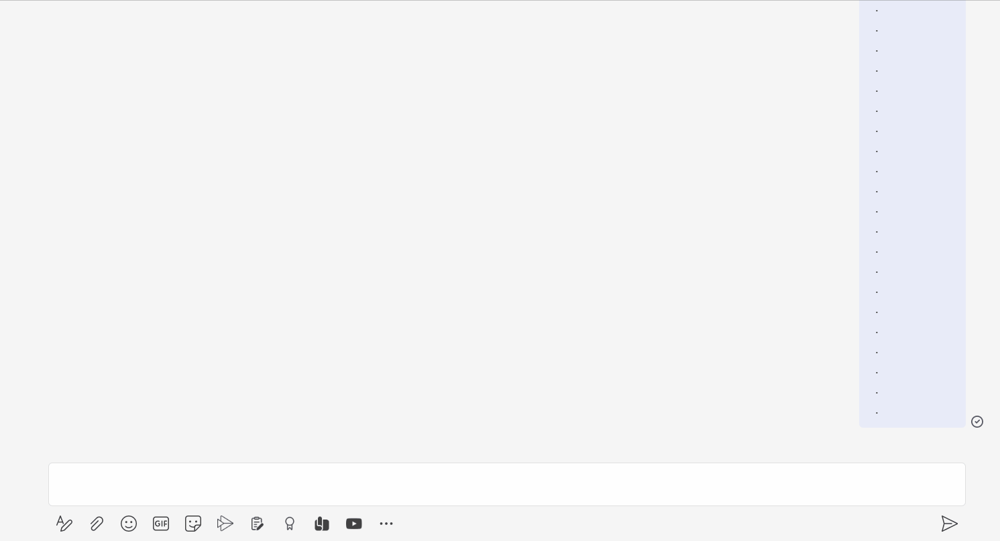

## PodeBot PoC

A very quick PoC of a PowerShell bot running on [Pode](https://github.com/badgerati/Pode) that works with Microsoft Teams.



* **Note:** It does not implement authentication for Pode server access, nor does it provide any scaffolding framework for dealing with user roles, privileges and permissions to determine who can run what command within Teams. PoshBot has some useful ideas around this.
* **Note:** This is currently untested on anything other than Windows 11 22H2.

### Running the Pode Server (bot):

1. If required, install the Pode module with `Install-Module -Name Pode`.
2. If required register a new bot at: https://dev.teams.microsoft.com/bots
3. If required create a client key and secret. Store details in `/secrets/clientdetails.json` like below:

```
{
	"clientid": "clientid-aka-appid",
	"clientsecret": "secret"
}
```

4. If required, ensure [ngrok](https://ngrok.com/download) is registered in a PATH variable, or modify `Start-Ngrok` in `server.ps1` to specify a `-Path` to ngrok.exe.
5. Run `server.ps1`. ngrok should start, and the server should be accessible at [http://localhost:8099](http://localhost:8099)
6. Update your bot's endpoint to the `https` ngrok domain with `/api/messages` on the end (https://dev.teams.microsoft.com/bots).

### Provisioning a Teams App:

1. Update `bot/manifest.json`: `id`, `bots\botId` with the client id, any other descriptive fields, and the ngrok domain at the bottom (though this appears unnecessary for testing).
2. Zip the contents of the `bot` folder (i.e. `resources` and `manifest.json`) and then [sideload it into Teams](https://docs.microsoft.com/en-us/microsoftteams/platform/concepts/deploy-and-publish/apps-upload).

### Testing:

If using as a 'personal app' (1-to-1 chat):

* Teams should display some suggested commands. These are defined in the manifest file, and handled in `messages.ps1`. If not, try issuing either: `pt` for a plain text reply, `ptwu` for an initial reply with an update, or `ac` for an adaptive card response.

If using in a group chat or Teams channel, you'll need to @mention the bot before typing a command.